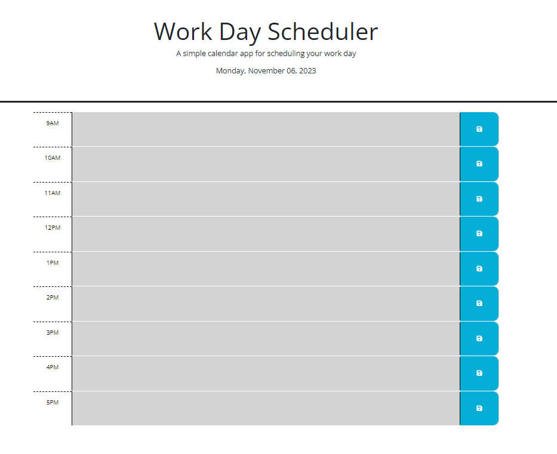
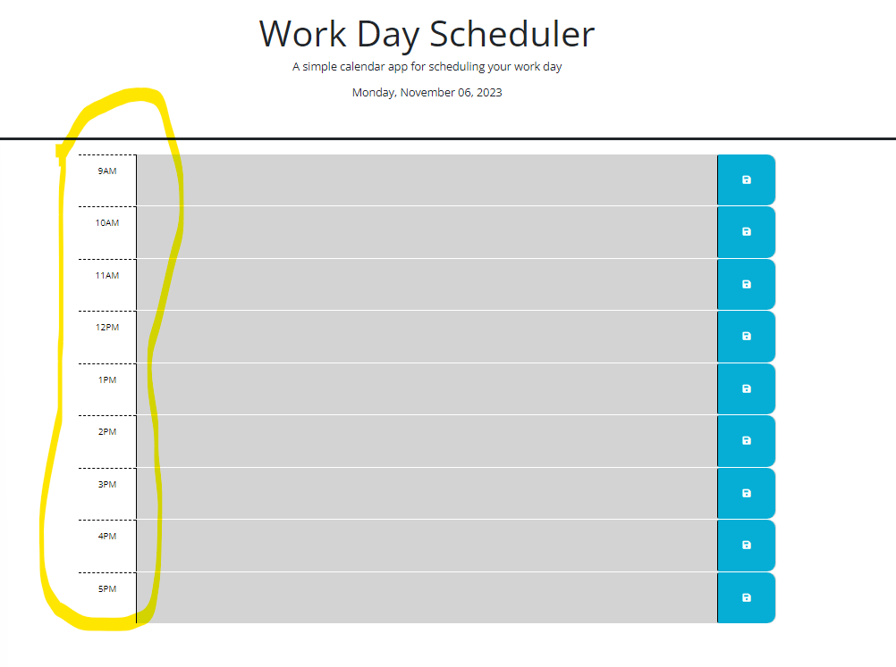
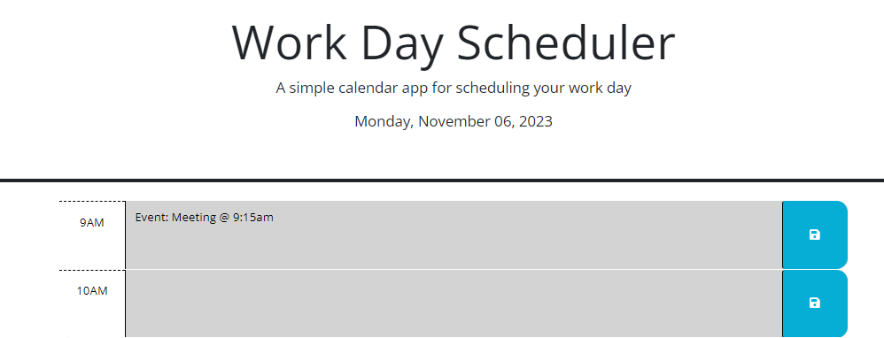
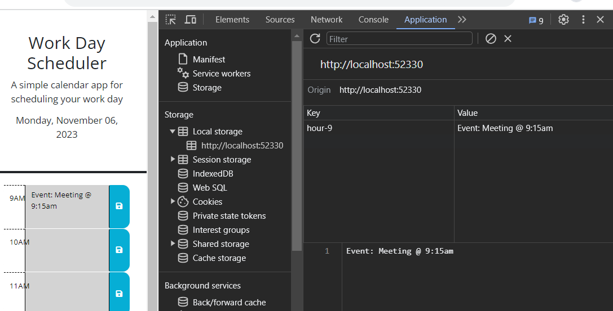
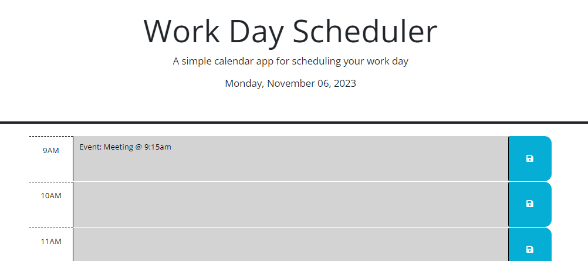

# Week-5-DailyPlanner
Daily Planner
## Description
In the Week-5-Challenge we were expecte to created a daily planner for an employee with a busy schedule. Acceptance criteria listed below.
- Given I am using a daily planner to create a schedule
- When I open the planner
- Then the current day is displayed at the top of the calendar

- When I scroll down
- Then I am presented with time blocks for standard buisness hours of 9am-5pm

- When I view the time blocks for that day
- Then each time block is color-coded to indicate whether it is in the past, present or future
- When I click the time block
- Then I can enter an event

- When I click the save button for that time block
- Then the text for that event is saved in local storage

- When I refresh the page
- Then the saved events persist

## Installation
N/A
## Usage
This is a daily planner to remind of what is going on during the working day 9am-5pm.
## Credits
Whitney Simpson
## License
N/A

